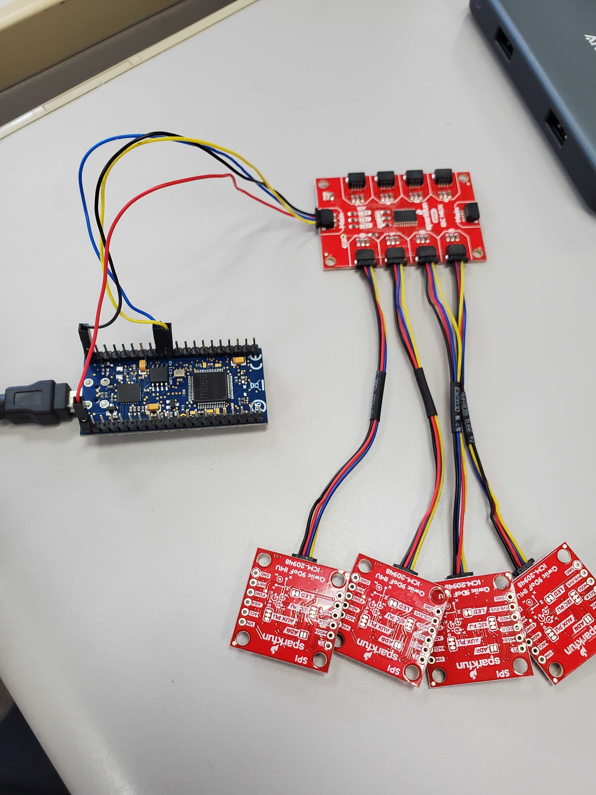
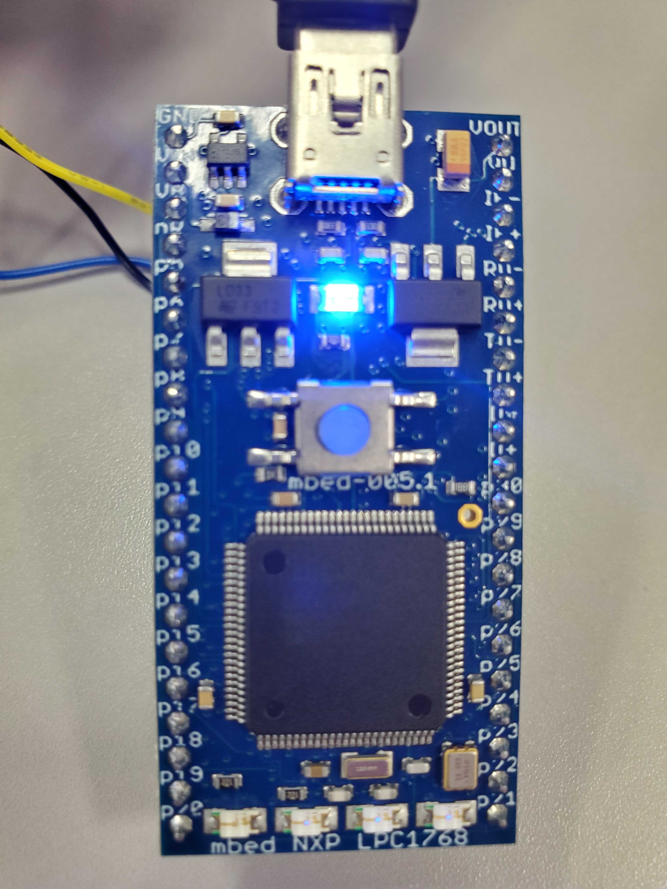

# 加速度センサ値のグラフ化

 mbedに加速度センサ(IMU-20948)を接続し，Pythonプログラムによるシリアル通信で値を取得して，matplotlibで3次元グラフ表示しました．


[TOC]


## 結果の例

次の写真のように，マルチプレクサを介して4つの加速度センサをmbedに接続した．



以下のようなグラフが出力された．加速度センサの1つを不規則に動かした．


## 実行方法

1. [dist](dist/)内の2ファイル(GlaphingAccelerometer.bin, readserial.py)をダウンロード．

2. マルチプレクサを介して加速度センサを接続したmbedをPCにUSB接続する．ピン配置は以下表の通り．
   | コード色 | 役割 | 接続先 |
   | -------- | ---- | ------ |
   | Black    | GND  | GND    |
   | Red      | 3.3V | VOUT   |
   | Blue     | SDA  | p9     |
   | Yellow   | SCL  | p10    |

3. binファイルをmbedのストレージにコピーする．すでに実行イメージがある場合には退避もしくは削除する．

4. mbedのリセットボタンを押す．(画像中央青ボタン)
   

5. mbedのマウント先を確認する．

   ```bash
   ls -l /dev/tty.*
   ```

6. Pythonプログラムを実行する．4で確認したマウント先に適宜書き換える必要がある．

   ```bash
   python readserial.py /dev/tty.usbmodem143102
   ```

6. グラフの描画が始まる．加速度センサを動かせば変化が確認できる．


## mbed開発環境の再現

 [src](src/)内のファイルを用いてmbedの開発環境が再現できる．

**できること**

- センサを1つだけ接続して値を出力する
- mbedのストレージにセンサの出力値をCSV形式で保存する
- マルチプレクサを介してセンサ4つの値をMbedStudio上で出力する
- シリアル通信で値を取得して3次元グラフ表示する

[mbed開発環境の再現](docs/mbed開発環境の再現.md)に手順をまとめた．

[技術的解説](/docs/技術的解説.md)として，調査したmbedの扱い方やソースコードの説明がある．


## 今後の展望

 現在，グラフの表示はセンサの動作とのタイムラグが大きい．より軽量なグラフ表示方法やコードの無駄な処理を省くことで高速動作を目指すことができる．(*mbedからの値取得自体は高速にできているので，取得したデータの扱いからグラフ表示が改善点として考えられる．*)

  またさらに複数のセンサを取り付けることもできる．マルチプレクサの空きポートはもちろん，センサを数珠つなぎにすることも可能で，マルチプレクサは1接続で64個のI2Cバスまで可能である．([Qwiic - TCA9548A搭載 8チャンネル Mux拡張基板 - スイッチサイエンス](https://www.switch-science.com/catalog/6496/))

  シリアル通信でやりとりしているデータを一度文字にしているので，処理速度が大幅に落ちていると考えられる．センサから読み取ったバイト列をそのままシリアル通信に載せ，Pythonプログラム側で解析するほうが処理速度の向上が見込める．
