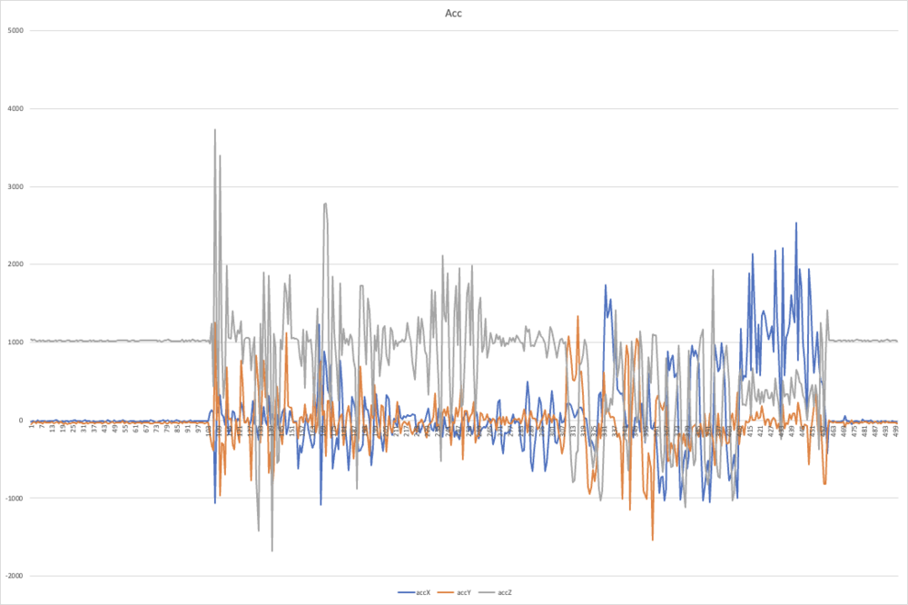
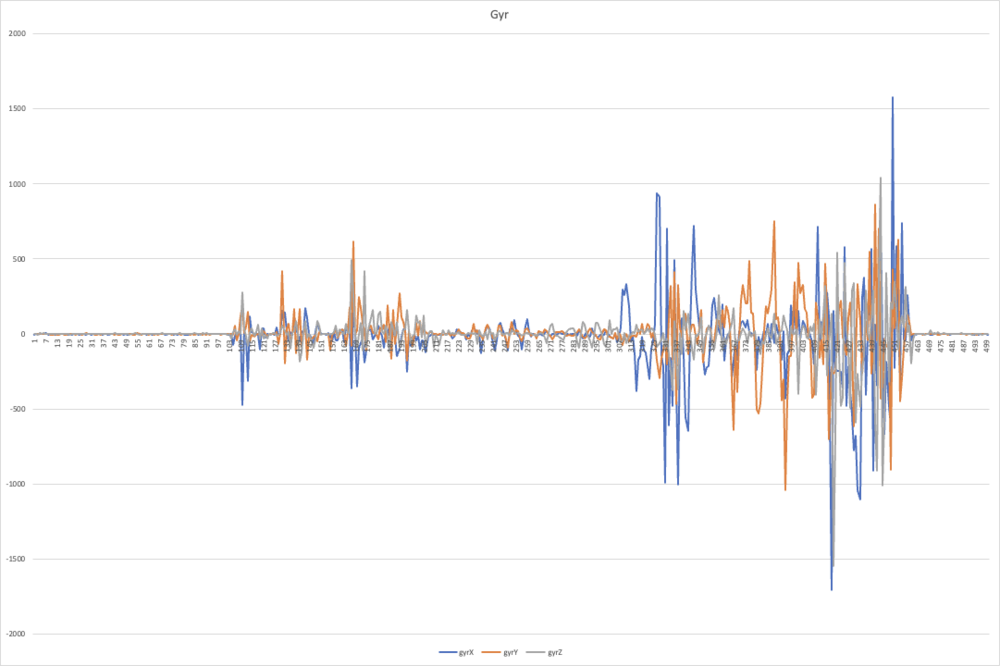

# mbed開発環境の再現

mbedに加速度センサを接続し，Pythonプログラムでシリアル通信を行ってグラフ表示を行った．


[TOC]


## 使用デバイス
  - 
  - [mbed LPC1768](https://os.mbed.com/platforms/mbed-LPC1768/)
  - 加速度センサ [ICM-20948](https://www.switch-science.com/catalog/5854/)　×4
  - マルチプレクサ [TCA9548A](https://www.switch-science.com/catalog/6496/)


## 開発環境
PC


- MacBookPro 16inch, 2019
- macOS Big Sur 11.3.1
- M1MacbookProでも動作確認済み
- mbedとはUSB接続
  - [Anker PowerExpand 8-in-1](https://www.ankerjapan.com/item/A8380.html)を利用


mbed

  - Mbed Studio1.4.1.13


Python
  - conda 4.9.2
  - Python 3.8.5


## 環境構築
  - [Mbed Studio | Mbed](https://os.mbed.com/studio/)TaからMbed Studioをダウンロードする．
  - 　サインアップが必要．
  - 　ブラウザ上で動作するIDEもあるが試していない．Mbed Studioのほうが新しい．
  - mbedをPCに接続し，中を確認する．
  - 　`*.bin`ファイルが実行ファイル．事前に退避または削除しておく．
  - 　中に残すのは`MBED.HTM`のみ
  - Mbed Studioを起動し，画面左"Target"欄に"mbed LPC1768"があればOK．
    - 

  - File>New Program...からLチカなどを試して見ると良い．
      - 　


## 加速度センサの接続
　

  - [Qwiic Connect System - SparkFun Electronics](https://www.sparkfun.com/qwiic)のFREQUENTLY ASKED QUESTIONS"What’s the pinout again?"を参考に，以下の通り接続した．
    
      - | コード色 | 役割 | 接続先 |
        | -------- | ---- | ------ |
        | Black    | GND  | GND    |
        | Red      | 3.3V | VOUT   |
        | Blue     | SDA  | p9     |
        | Yellow   | SCL  | p10    |
        
    - 場所は上の写真やボードを確認．
    
    - 


## 単体の加速度センサで値を取得する

1. GitHub上のブランチ"SingleICM"を選択

2. 以下のファイルをmbedのワークスペースにコピーする．

  - main.cpp
      - 　　センサの初期化〜値の表示を行うメインプログラム
  - mbed_app.json
      - 　　プログラム実行に必要な設定ファイル．アプリルートに置く必要がある．ここでは`printf`でfloat型を扱うための設定を行っている．
  - spf_ICM208948_Driver
      - 　 センサ(ICM-20948)のドライバ
      - 　 [Arduino向けのICM-20948ライブラリ](https://github.com/sparkfun/SparkFun_ICM-20948_ArduinoLibrary)を先生がポーティングしてくれたもの．


3. ライブラリのインストールを行う．


  - 　センサから読み取った値を出力するためにSerialStreamが必要．
  - 　[SerialStream | Mbed](https://os.mbed.com/users/MultipleMonomials/code/SerialStream/docs/tip/)にアクセス．
  - 　
　　Import into Mbed Studioを選択して，指示に従う．


4. Mbed Studio左のBuildを押して実行ファイルの作成．


  - `アプリルート/BUILD/LPC1768/ARMC6/`に生成されたbinファイルをmbedのルートにコピー．

　

5. mbed上のボタンを押して実行．以下のような出力が得られるはず．

- 

  　`imu.getAGMT(true)`で設定ファイルの取得と3軸加速度，3軸ジャイロ，3軸磁気，温度の取得が可能．
    　`imu.getAGMT(false)`で設定ファイルの取得を省略(実行速度がほぼ倍になる)[[選択中]]
    　`imu.getAG(false)`で3軸加速度と3軸ジャイロのみを取得する．

- 結果をCSVに書き出してグラフ化した例．
  - Acc
  - Gyr
  - Mag
  - Tmp
  - GitHub上のブランチ"SingleICM(CSV)"にあるmain.cppと置き換えれば実行可能．
    - mbed上にcsvファイルを書き出します．実行中は**mbedへアクセスできなくなる**ので注意．


mbed上で動作しているプログラムが終了しない，開いているファイルハンドルを開放しない場合には次の方法でmbedを再接続する．

　　　1. mbedをPCから取り外す
　　　2. リセットボタンを押したままPCに接続する．(接続してもボタンは離さない)
　　　3. 新しいプログラムをmbedに保存する．
　　　4. ボタンを離す．


## マルチプレクサを介して複数のセンサから値を取得する
- ここではマルチプレクサを使って複数のセンサを接続し，そこから読み取った値をmatplotlibの3次元グラフに表示します．

  - GitHub上の最新のプログラムをクローンすると利用できます．(Tags"MultiICM")[~ まだ載せていない]


  - 写真のようにマルチプレクサにセンサを接続する．
  - 


  - シリアル通信を行うデバイスのパスを確認

  - ```bash
    ls -l /dev/tty.*
    ```

  - 適切なものを選択．わからなければ，USBを抜き差しした前後に表示が変わるものを選べば良い．ここでは`/dev/tty.usbmodem143102`

  - `python readserial.py <デバイス名>`で実行できる．上の例では次のようなコマンド

  - ```bash
    python readserial.py /dev/tty.usbmodem143102
    ```


- このようなグラフが得られる．直近10件のデータを表示している．
  - これはセンサの一つを振り回している様子．
  - 


- pythonプログラムと同じディレクトリにセンサの全ての出力値を記録したcsvファイルがセンサごとに保存されている．