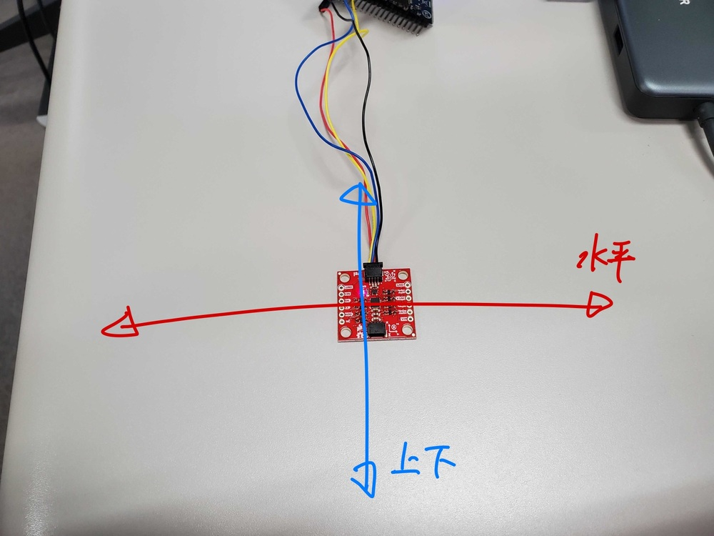
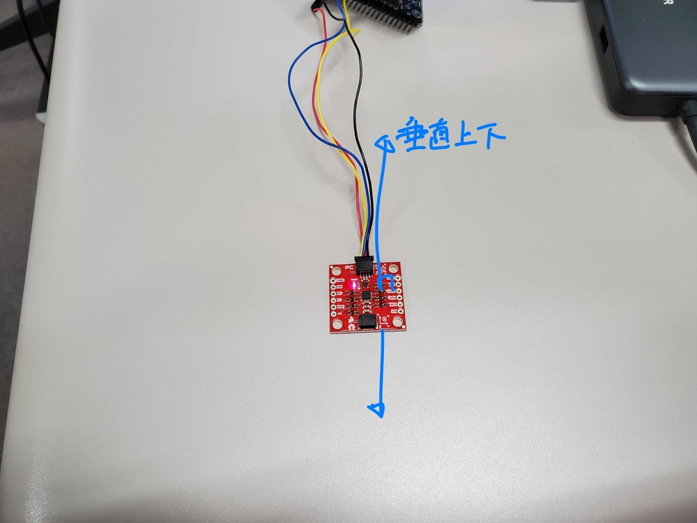
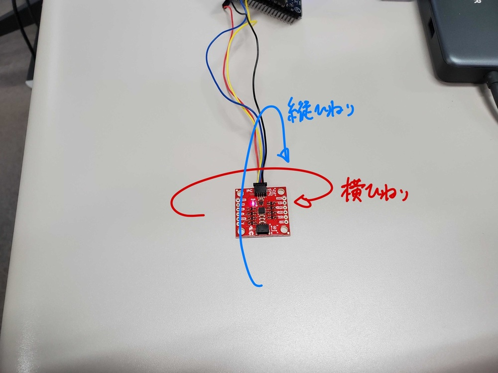
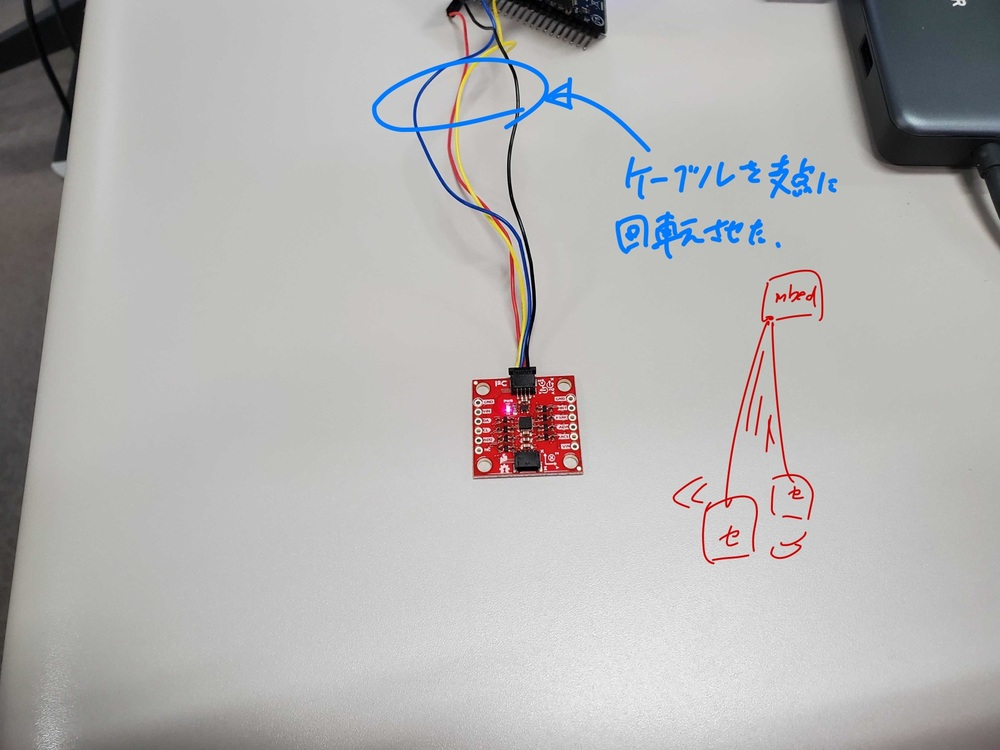
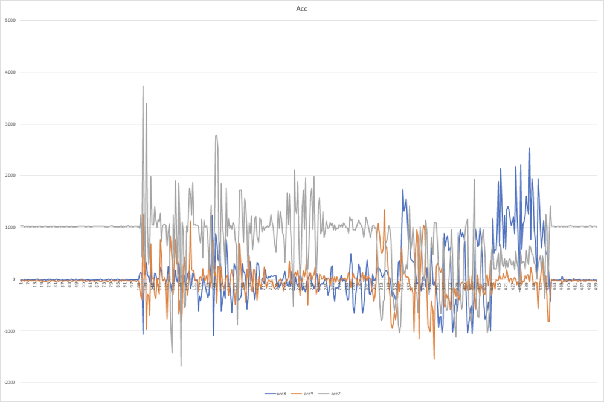
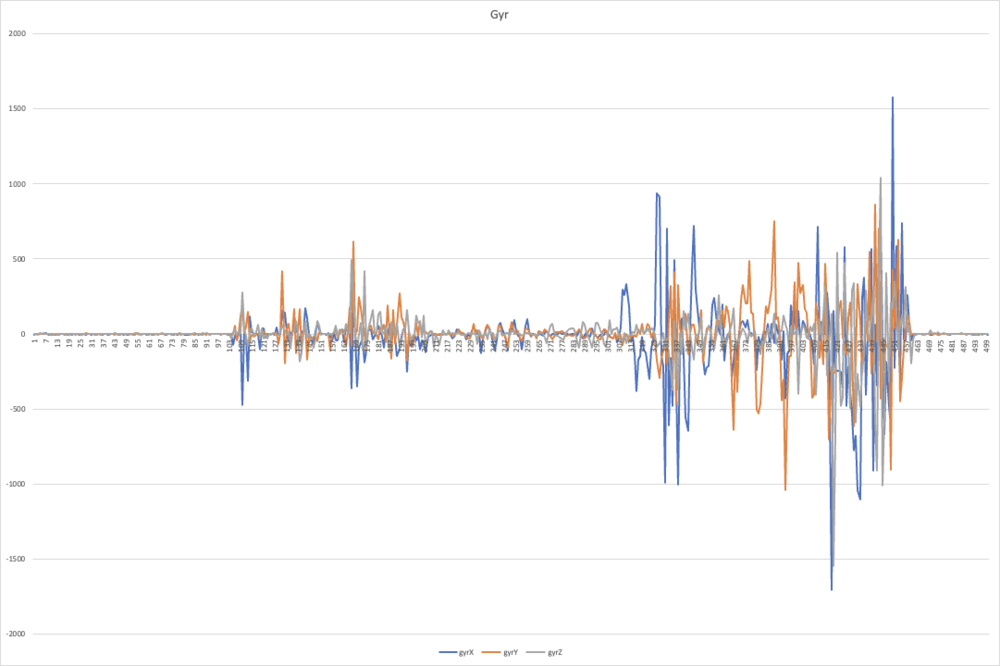
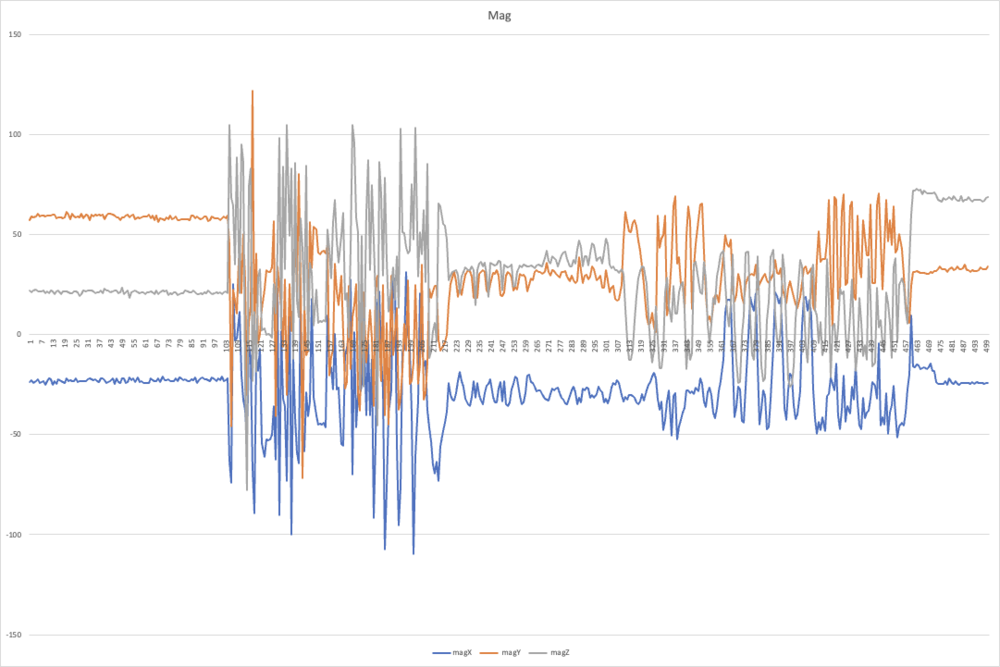
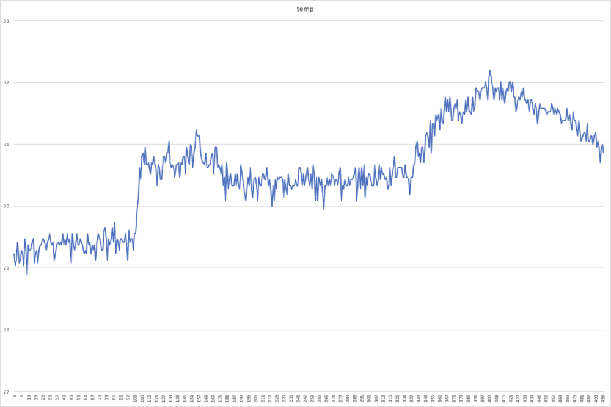

# 技術的解説

mbedについて調査した内容と，ソースコードの一部について説明をまとめる．


[TOC]

## Mbed Studioについて

2019年頃にベータ版としてリリースされていた．2021年現在は公開版としてバージョン1.4.0が配布されている．

他にオンラインIDE，オフライン環境としてCUIベースのMbed CLIが提供されている．

Mbed StudioはコンパイラとしてGCC ArmではなくArm Compilerが搭載されていることが特徴．([Mbed Studio 1.0 リリース！ - Qiita](https://qiita.com/jksoft/items/7f92835e47b54580c792 ))

### ビルド方法とビルドオプション

[Arm Mbed Studio - Arm Mbed Studio | Mbed Studio Documentation](https://os.mbed.com/docs/mbed-studio/current/introduction/index.html)より，

> To build:
>
> If you don't have a board, click Build (the hammer icon). This builds Blinky and stops.
> If you have a board connected, click Build and run (the play icon). This builds Blinky and flashes it to the connected board.
> You may need to restart your board for Blinky to run.

> Select a build option:
>
> Build program: Build the program, without flashing it to the device.
> Build: Checks the BUILD sub-directory (where the previous build is stored) and optimises build time by using as much as it can from the last build. For example, if two consecutive builds are for the same target and using the same build profile, the build will rebuild only the files that actively changed between the two builds, or from the point at which you stopped the previous build attempt.
> Clean build: Ignore all previous builds. A clean build is slower than reusing a previous build, but guarantees your build will have no old artefacts.
> Debug program: Build the program and flash it to the device, then start a debug session.
> For more information about debug, see Debugging with Mbed Studio.
> Run program: Build the program and flash it to the device, without starting a debug session.

- Build：プログラムのビルド．デバイスには書き込まない．
- Clean build：過去のビルドを無視して全てビルドし直す．
- Run program：ビルドしてデバイスに書き込む．デバッグセッションには移らない．
- Debug program：ビルドしてデバイスに書き込み，デバッグを行う．


## 使用したデバイスについて

#### [mbed LPC1768](https://os.mbed.com/platforms/mbed-LPC1768/)

#### 加速度センサ [ICM-20948](https://learn.sparkfun.com/tutorials/sparkfun-9dof-imu-icm-20948-breakout-hookup-guide)

-  I²CとSPIが利用可能で、Qwiicシステムに接続して使用することができる

- 3軸ジャイロセンサ、3軸加速度センサ、3軸磁気センサを搭載

- ジャイロセンサと加速度センサはそれぞれ四つのレンジから選択することが可能

- モーションセンシングのアルゴリズムによる計算をオフロードするデジタルモーションプロセッサも備えている．

  > 供給電圧：1.95〜3.6 V
  > 3軸MEMSジャイロセンサ
  > フルスケールレンジ：±250 dps、±500 dps、±1000 dps、±2000 dps
  > ユーザによるプログラムが可能
  > 3軸MEMS加速度センサ
  > フルスケールレンジ：±2 g、±4 g、±8 g、±16 g
  > ユーザによるプログラムが可能
  > 3軸シリコンモノリシックホール効果磁気センサ
  > フルスケールレンジ：～±4900 µT
  > レジスタとの通信用
  > I2C：最大100 kHz（標準モード）/ 最大400 kHz（高速モード）
  > SPI：最大7 MHz
  > デジタルモーションプロセッサ（DMP）
  > デジタル出力温度センサ
  > Qwiicコネクタ × 2
  > I2Cアドレス：0x69（ジャンパ付き0x68）

#### マルチプレクサ [TCA9548A](https://www.switch-science.com/catalog/6496/)

- 1接続で64個のI2Cバスまで可能

  > 動作電圧範囲：1.65 V～ 5.5 V
  > 動作温度範囲：-40～85° C
  > I2Cアドレス：0x70 （標準）～0x77
  > 10x Qwiicコネクタ
  > 2x パススルー（ デイジーチェイン）
  > 8x チャネル


## mbedのピン配置

　
　[mbed LPC1768 | Mbed](https://os.mbed.com/platforms/mbed-LPC1768/)より，SDAはp9またはp10，SCLはp27またはp28に繋げば良い．
　`PinNames.h`で`I2C_SDA1`と`I2C_SCL1`がそれぞれ定義されていて，これらはp9,p27を指している．

  - [Qwiic Connect System - SparkFun Electronics](https://www.sparkfun.com/qwiic)のFREQUENTLY ASKED QUESTIONS"What’s the pinout again?"を参考に，以下の通り接続した．
    
      - | コード色 | 役割 | 接続先 |
        | -------- | ---- | ------ |
        | Black    | GND  | GND    |
        | Red      | 3.3V | VOUT   |
        | Blue     | SDA  | p9     |
        | Yellow   | SCL  | p10    |


## 1つのセンサからMbed Studio上に値を出力するプログラム

以下の関数で値を取得する．

- `imu.getAGMT(true);  // 1350 ns interval`
  - acc, gry, mag, tmpを取得．
  - スケーリングされた値を計算できるように設定を取得する．
- `imu.getAGMT(false);  // 786 ns interval`
  - acc, gry, mag, tmpを取得．
  - 設定の取得を行わない．
- `imu.getAG(false); // 526 ns interval`
  - acc, gryのみ取得．


### センサ内のデータアドレス


なぐり書きのメモで汚くてすみません．

まとめると，

- 加速度，ジャイロ，温度はビッグエンディアンで各軸2バイトのデータとして保持している．
- 磁気データのみ，リトルエンディアンで各軸2バイトずつのデータと，statデータを持っている．


### mbedのprintfでfloat型が表示できない？

 mbedではコードサイズを減らすために"Minimal printf and snprintf"というものを導入している．`minimal-printf-enable-floating-point`設定がデフォルトではdisabledになっているので，これをtrueにする必要がある．(参考：[Float Printf() doesnt work in desktop version - Mbed OS / Bugs - Arm Mbed OS support forum](https://forums.mbed.com/t/float-printf-doesnt-work-in-desktop-version/9164)

 configuration systemを使って解決する．`mbed_app.json`をアプリルート直下において解決した．


### configuration system

[The configuration system - Program setup | Mbed OS 6 Documentation](https://os.mbed.com/docs/mbed-os/v6.9/program-setup/advanced-configuration.html)

各ライブラリは`mbed_lib.json`でいくつかのパラメタを定義．

プログラムレベルの`mbed_app.json`はパラメタのオーバライドが可能．

アプリケーションは、**アプリケーションのルートに一つの mbed_app.json**を持ち、**アプリケーション全体に多くの mbed_lib.json**ファイルを持つことができます。mbed_app.jsonがあると、ライブラリやターゲットで定義されたコンフィギュレーション・パラメータを上書きしたり、新しいコンフィギュレーション・パラメータを定義したりすることができます。

#### 設定パラメータのオーバーライド
- 設定システムでは、"target_overrides "という名前のJSONオブジェクトを使って、定義された設定パラメータをオーバーライドすることができます。

-  target_overrides "セクションのキーは、オーバーライドが適用されるターゲットの名前、またはすべてのターゲットに適用される特別なワイルドカード "*"です。target_overrides "セクションの値は、mbed compile --configで表示された設定パラメータを新しい値にマッピングするオブジェクトです。

mbed_app.jsonはアプリルート直下に，mbed_lib.jsonはいろんな場所にある．


## 加速度センサの値をmbedのストレージにCSVとして書き出す

LocalFileSystemを使うとPCからアクセスできるmbedのストレージに，mbed自身からアクセスできる．

参考:[おまけ (mbedを始めましょう！("Let's get started!" in Japnaese)) | Mbed](https://os.mbed.com/users/nxpfan/notebook/lets_get_started_jp_omake/)

mbedでは書き込みを始めると，PC側からは取り出されたように見える．そのため新しいプログラムの書き込みができなくなる．ファイルがクローズされた時に再マウントされる．

**強制終了方法**

 >注意事項
 >マイコンプログラムがローカルドライブ上のファイルを開くと、ホストコンピュータ上では「削除済み」と表示されます。これは正常な状態であり、mbedとPCが同時にディスクにアクセスしようとするのを防ぐためです。
 >
 >警告
 >USBドライブが再び現れるのは、あなたのプログラムですべてのファイルハンドルが閉じられるか、マイクロコントローラーのプログラムが終了したときだけです。
 >
 >mbed上で動作しているプログラムが終了しなかったり、開いているファイルハンドルを解放しなかったりすると、mbedをPCに接続してもUSBドライブを見ることができなくなります。再びドライブを見られるようにする（新しいプログラムをロードする）には、以下の手順で行います。
 >
 >マイコンのプラグを抜く
 >リセットボタンを押し続ける
 >リセットボタンを押したまま、マイコンを接続します。mbedのUSBドライブが現れるはずです。
 >新しいプログラムがUSBドライブに保存されるまで、ボタンを押し続けます。


### センサの挙動を確認

室温23℃，湿度30%くらいの環境で，加速度センサの挙動を確認した．

【測定方法】

データの取得を500回行った．操作の切り替えは目視なので多少のズレが有る．

- 0-100 机の上で静止．
- 100-200
  - 
  - 100-150 机の上で水平方向に移動．
  - 150-200 机の上で上下方向に移動．
- 200-300
  - 
  - 200-250 机の上から垂直に上下させる．
  - 250-300 空中で水平に移動

- 300-400
  - 
  - 300-350 横にひねりを加える
  - 350-400 縦にひねりを加える
- 400-450 ケーブルを支点に振り回す．
  - 

- 450-500 机の上で静止させる．


- グラフは折れ線．
  - 散布図を最初に選んだが，遷移がわかりにくかった．
  - 折れ線を追加したら各forステップでの遷移がわかりやすくなった．


Acc：平面的な動きにzがよく反応する．回転運動にxとyが反応する．



- 0-100 静止中はほぼ動きなし．
- 100-150 机上で動かしているのに，zが大きく出ている．水平に動かすと，xに比べてyが大きいか．
- 150-200 上下に動かすと，yよりxが大きく出ている．
- 200-250 垂直に動かしている間はx,yの動きは小さい．zの動きも小さくなっている？
- 250-300 空中で横に動かしている間はxに少し動きがある．
- 300-350 横ひねりはyとzが大きく動く．ひねりが一番Accに反応する？
- 350-400 縦ひねりはxとzが大きく動く．yの動きは小さくなった．ひねりが動き大きい．
- 400-450 値の位置は変わるが揺れが小さい？
- 450-500 0-100の状態に戻る．動きはなし．


Gyr：ひねりに対してxとyがよく反応する．



- 0-100 静止中はほぼ動きなし
- 100-200 机の上での移動にはxとyに少し反応があった．
- 200-300 持ち上げている間はほとんど反応がない．
- 300-350 横のひねりはxに大きく反応している．
- 350-400 縦のひねりはyに大きく反応している．
- 400-450 振り回すとほぼ全て大きく揺れた．特にこれまで動きの小さかったzにも動きが見られた．
- 450-500 0-100の状態に戻る．動きはなし．


Mag：机の上での平行な移動によく反応する．



- 0-100 一定
- 100-200 机の上で動かすだけで全ての値が大きく揺れる．
- 200-300 空中で移動させる分には比較的値の変化が小さい．
- 300-350 横にひねるとyが大きく動いた．yとzが反転した？位置が入れ替わった．
- 350-400 縦にひねるとxが大きく動いた．zの動きは横のときとそれほど変わらない．
- 400-450 振り回すと全てが大きく揺れた．
- 450-500 最初に比べ，yとzが反転し，値もやや高くなった．安定はしている．


Tmp



- 全体的に温度が上がり傾向．処理でセンサが熱を持った？
- 100-350 でほぼ一定の温度．350から上がったのはなぜ？持つ位置？
- 運動をやめた450からは値は下がり気味．


## マルチプレクサを介して複数センサを接続

### マルチプレクサのアドレス指定

`QWIIC_MUX_DEFAULT_ADDRESS`は0x70を1ビット左シフトした0xE0を指定している．Hookupでは0x70を指定しているが，経験的にこちらのほうがうまく動いた．(参考:[Qwiic MUX Hookup Guide - learn.sparkfun.com](https://learn.sparkfun.com/tutorials/qwiic-mux-hookup-guide))

0x70の指定時には`NO SLAVE`のエラーが出る．


### センサの数に応じてインスタンスを用意する

共通の`ICM_20948_I2C`インスタンスを複数のセンサで流用していると，初期化処理には成功するが，データ読込前の`dataReady`メソッドが失敗するため値が取得できない．

解決策としては，センサの数に応じてインスタンスを用意すれば良い．

メモリ量増大が心配されるが，インスタンスが1つのときに比べ，4つにしても3.7%のサイズアップで，それほど問題にはならないと考えられる．

- 4つのセンサ接続時：10302bytes
- 1つのとき：9934bytes


### mbedのメモリ量

[mbed LPC1768 | Mbed](https://os.mbed.com/platforms/mbed-LPC1768/#firmware)より，

> NXP LPC1768 MCU
> High performance ARM® Cortex™-M3 Core
> 96MHz, 32KB RAM, 512KB FLASH
> Ethernet, USB Host/Device, 2xSPI, 2xI2C, 3xUART, CAN, 6xPWM, 6xADC, GPIO

MbedのRAMは32KBで，仮想メモリのような機能はないだろうから，これ以上のプログラムを置けない．


## mbedとシリアル通信

Pythonのシリアル通信ライブラリ`pyserial`を使って，mbedからシリアル通信で値を取得した．

`conda install pyserial`でインストールした．


シリアル通信は複数のプログラムからアクセスできない．以下のようなエラーが出る．

```device reports readiness to read but returned no data (device disconnected or multiple access on port?)```

Pythonから取得するときにはMbed Studio上のシリアルモニタを閉じる必要がある．


### シリアル通信内容の解析

今回mbedがシリアル通信に送るデータは以下のような形式である．

`sid0:9.70,13.00,-122.31`

これをグラフ化に適したデータ構造に収める．


まず，シリアル通信で送られてくるのはバイト列であり，Python上で文字列処理をするのに不都合であったので，文字型にキャストした．


実際の値の読み取りでは，値取得の準備中やエラーが出ているときは解析を行わないように，"sid"で始まらないときには`ValueError`とした．

データが格納されているのは，先頭5文字目〜末尾2文字目までである．末尾1文字は改行コードなので取り込まないようにした．

`split(',')`命令で，カンマ区切りでデータを分けた．9.70，13.00，-122.31が別々に文字型として得られる．

これをfloat型に変換し，リストに格納する．

リストは3層にした．これはmatplotlibでデータを出力するときのことを考慮した．

第一層がセンサ別，第二層がx,y,z別，第三層が時間別である．

例えば，`sensor[1][2][99]`は，センサ1番(厳密には1+1=2番)のy軸の99番目の値を意味する．


## センサ値のグラフ化

センサから取得される値を3Dグラフにリアルタイム出力する．得られる値が3軸の情報であったので3Dグラフを採用した．

グラフ化にはmatplotlibを用いた．


シリアル通信で解析したデータを，CSV出力用，グラフ表示用に分けてリストに格納した．

リストに格納するデータは，指定したデータ数を超えると先頭から削除するキュー方式とした．こうすることで，常に最新の指定件数分のデータがグラフ表示され，動いているように見える．


データ構造はやっつけな実装になってしまったため，見直せばより高速に表示できると考えられる．